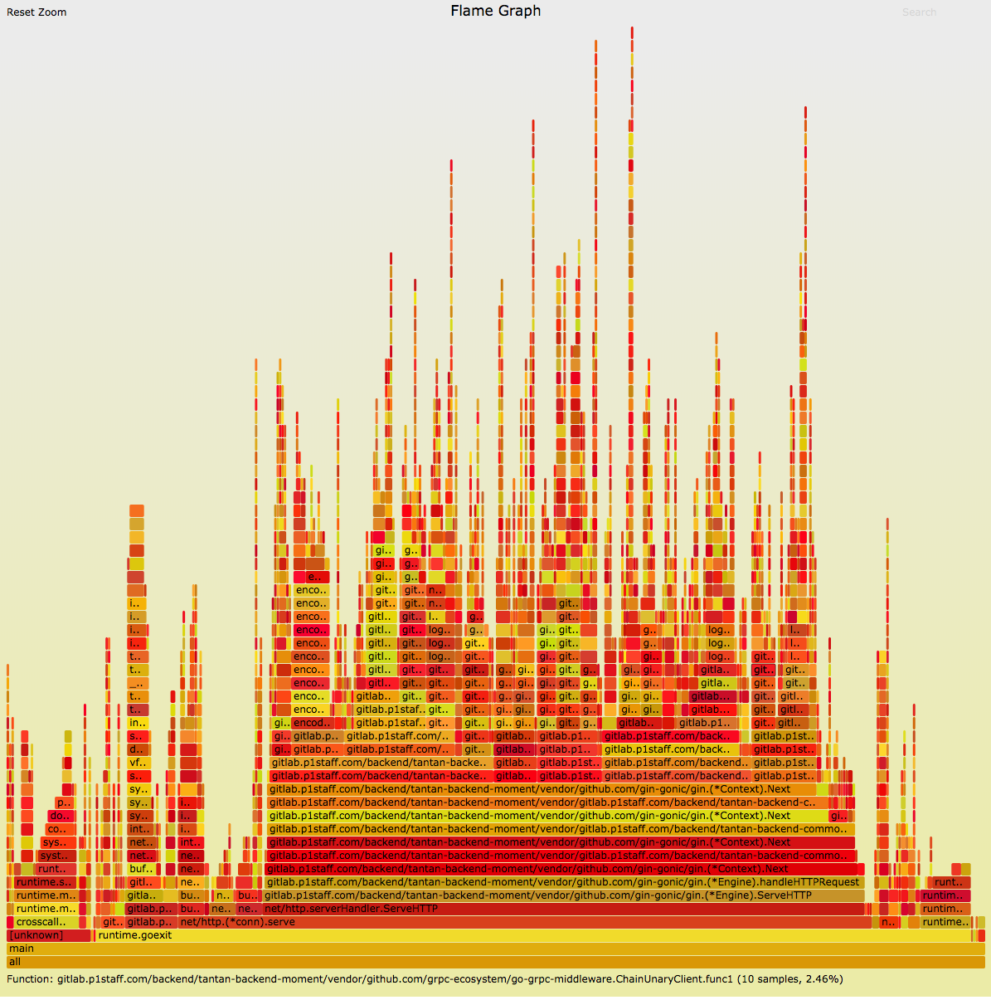

# an example

### 编译一个可追踪堆栈的二进制

> go build main.go

线上的Makefile文件中，加入很多的优化选项，造成无法追踪到函数调用的堆栈，对于分析性能问题有影响。因此，直接使用go build编译。

### 模拟流量

```shell
for (( i=0; i<1000000; i++))
do
curl '127.0.0.1:21268/v1/users/me/settings'
done
```

### 生成火焰图

- 生成perf.data

> perf record -F 99 -a -g -p 19638 -- sleep 30

**perf record**用于追踪事件，参数-F指定记录事件的频率99Hz，-g记录下函数调用的堆栈，-p参数指定监控的进程，--sleep参数指定监控的时间范围。

- 转换perf.data

> perf script > perf.txt

perf.data是一个二进制文件，需要把它转换为文本文件。

- 展开perf.txt

> stackcollapse-perf.pl perf.txt > perf.folded

- 生成svg

> flamegraph.pl perf.folded > perf.svg

### copy到本地使用浏览器打开svg

>  scp root@ms-follow-staging1:/root/perf/perf.svg ~/data

